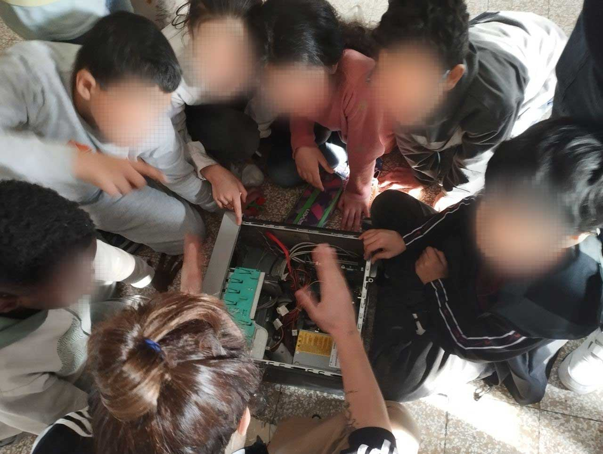

## A Creative Approach to Learning

In our most recent pre-sessions, Maestra Giorgia and I decided to inject a bit of mystery and excitement into the classroom. We designed an introductory quest, a story for the children to unravel. This approach was aimed at sparking their interest right from the start. 

Maestra Giorgia shared her insight that role-playing, woven with educational goals, could be one of the most engaging teaching methods. It's the allure of storytelling, together with the joy of play, that captivates young minds, making complex concepts more accessible and intriguing.

We reflected on what the role of a coder, someone who writes instructions for a machine, might mean to them. Considering they were learning about scribes in history class, we drew a parallel: just as scribes were essential in their time for documenting important information, today's programmers play a similar role in our digital world. The concept was to frame programmers as the modern scribes of our time, translating human intent into machine actions.
  

## The Quest Begins

The adventure started with the children discovering a secret message in class, a coded note that, once deciphered, led them straight to me in the computer room. But let's describe the setting correctly: our "computer room" is merely an empty space (for now), underused and forgotten, which we will eventually transform into a tech exploration zone.
 
 

 

A few days earlier, Maestra Giorgia and I unearthed some old, non-functional computers from the school's basement. These relics were about to become our primary teaching tools, our treasures to incite curiosity.

The moment I entered the room, I was greeted with eager faces. Although we had never met, the children displayed an instant gratitude, an intuitive recognition of the journey we were about to embark on together. Admittedly, I was nervous, feeling the weight of responsibility, but their openness quickly melted away my anxiety.
  

## Breaking the Ice and Diving In

We started with an ice-breaking session, sitting in a circle, exchanging questions. The children were curious about me, my past, and what we would be doing together. It was a moment of mutual curiosity, setting the ground for a collective learning experience.

It became clear they were mostly passive users of technology, unaware of the workings of their everyday devices. So, without delay, we rolled up our sleeves and got hands-on because active engagement is where the real learning begins.

I brought out an ancient computer, laid it bare in the center of the room, and the excitement was palpable. As Maestra Giorgia and I moderated the children's eagerness, I began explaining the inner connections and components of the computer.

 

 

Before leaving, I handed out assignments from [HelloRuby](http://helloruby.com) for them to complete before our next meeting. The activities included connecting-the-dots exercises linked to computer components and a craft project to build their paper computer models.

 

 

## Reflections on the Day

From this day, I took away several valuable lessons:

- My performance anxiety was unwarranted. Children have a way of making you feel at ease, and embracing your inner child helps you become part of the group.

- They grasp complex concepts faster than I anticipated.

- The subject genuinely interests them. Technology is not universally understood or accessible, and even their parents struggle to explain it. By demystifying tech, we're opening up new worlds for these children.

As we continue this journey, I'm reminded of the power of sharing knowledge and the profound impact it can have on young minds. I'm looking forward to what the future holds.

 
 

To conclude, I'd like to extend a heartfelt thank you to [Linda Liukas](http://lindaliukas.com) for her exceptional contributions to the world of coding education for children. Her work has been an invaluable resource during my course preparation, offering both inspiration and a solid educational foundation. The captivating illustrations were met met with great enthusiasm by the class.
  
This blog post is part of a series: 
- Part 1: <a href="/blog/teaching-journey-part-1/">The beginning of my teaching journey</a>
